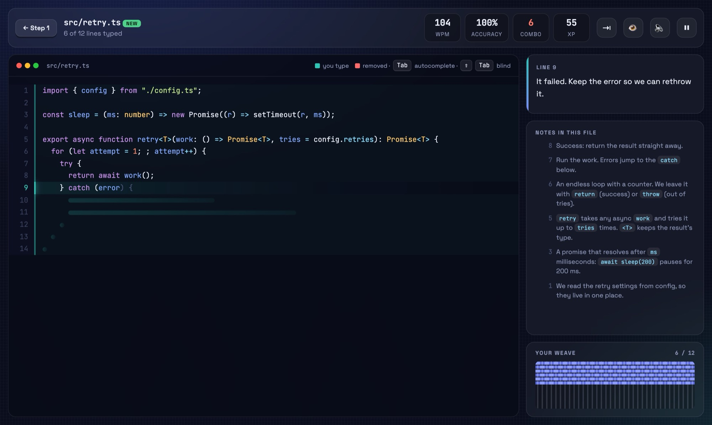
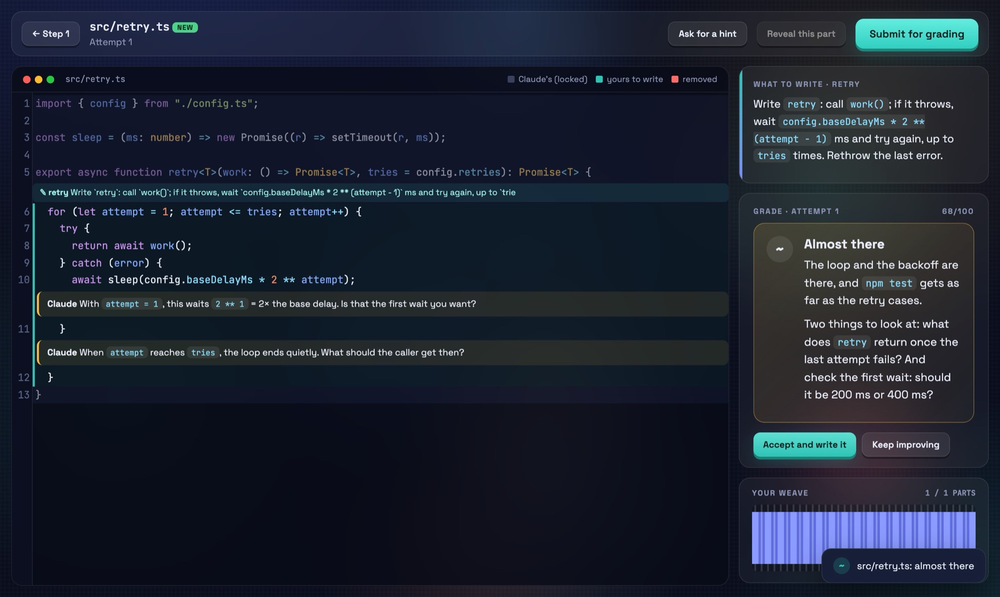
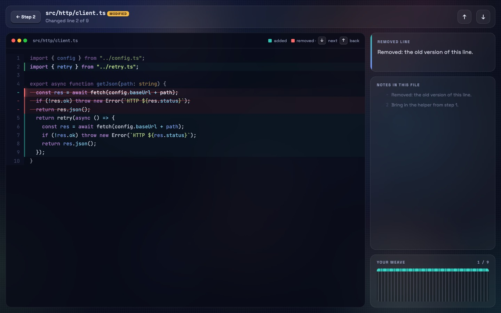
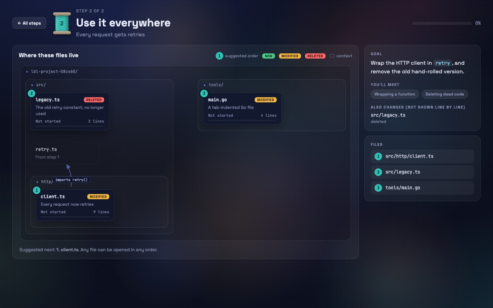
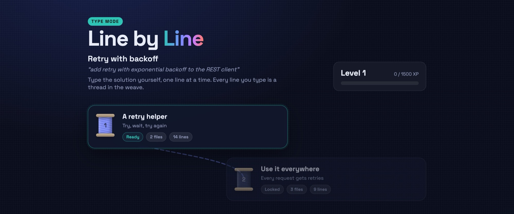
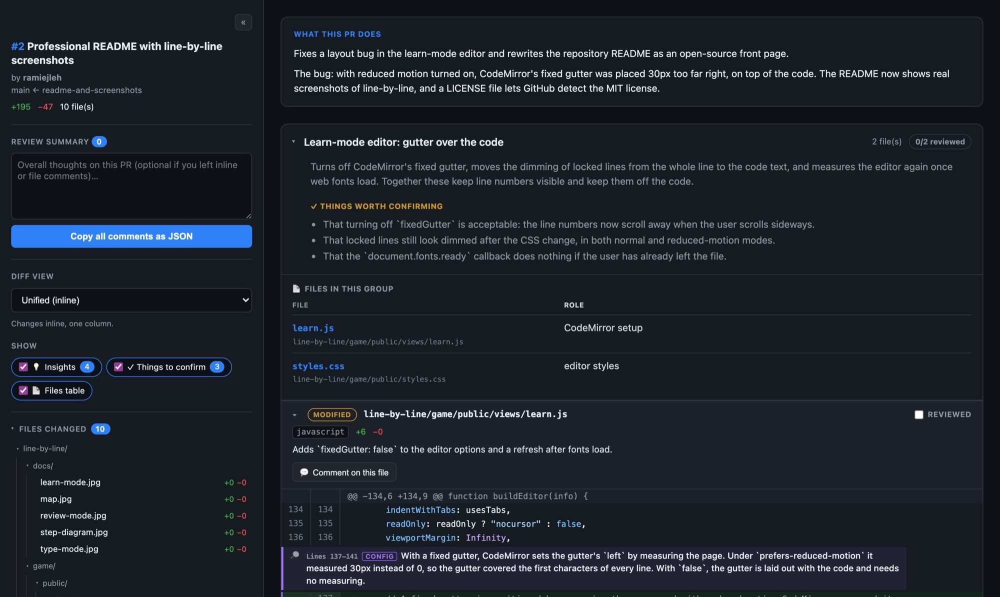
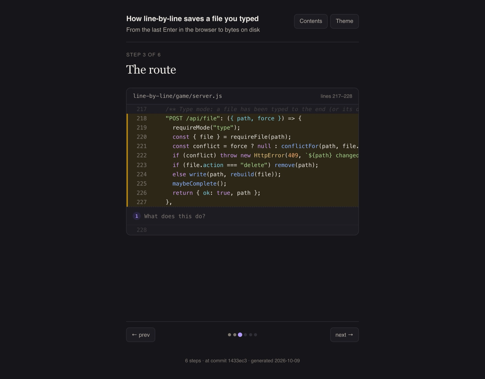
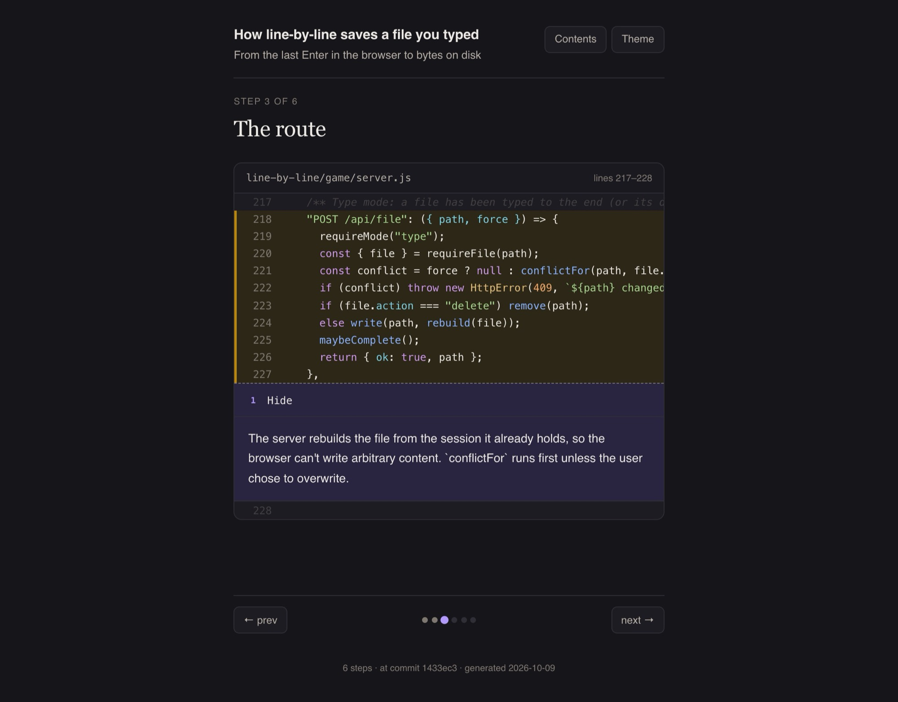

<div align="center">

# DefyAtrophy

**Claude Code plugins that keep you in the loop and your skills sharp while the AI writes the code.**

[](./LICENSE)
[](https://docs.claude.com/en/docs/claude-code)
[](https://nodejs.org)
[](#line-by-line)

[Install](#install) · [Plugins](#plugins) · [line-by-line](#line-by-line) · [interactive-pr-review](#interactive-pr-review) · [walkthrough](#walkthrough) · [Contributing](#contributing)

</div>

---

AI assistants can write code faster than anyone can read it. The risk isn't bad code; it's that you
stop understanding your own codebase and stop practising the skills that let you judge it.
**DefyAtrophy** is a small marketplace of [Claude Code](https://docs.claude.com/en/docs/claude-code)
plugins that put you back in the loop, without slowing Claude down.

## Plugins

| Plugin | What it does |
| --- | --- |
| [**line-by-line**](./line-by-line) | Claude solves the task in a scratch worktree, and **you** build it into your project in a browser game. Type it with a note on every line, write the logic yourself and get each file graded, or tab through any code (a branch, or "the auth implementation") line by line. [More below ↓](#line-by-line) |
| [**interactive-pr-review**](./interactive-pr-review) | Review GitHub PRs in a local UI. Claude groups the diff into logical chunks with neutral descriptions and inline insights, and posts your line comments back to GitHub in one click. [More below ↓](#interactive-pr-review) |
| [**walkthrough**](./walkthrough) | Turns a feature into a paginated HTML walkthrough you read like a book: real code in execution order, one step per page, explanations behind a click. [More below ↓](#walkthrough) |

## Install

Inside Claude Code, add the marketplace once and install the plugins you want:

```text
/plugin marketplace add ramiejleh/DefyAtrophy
/plugin install line-by-line@DefyAtrophy
/reload-plugins
```

Swap `line-by-line` for `interactive-pr-review` or `walkthrough` to install the others. To update later:

```text
/plugin marketplace update DefyAtrophy
/plugin install line-by-line@DefyAtrophy
```

---

## line-by-line

> Write the code yourself, line by line.

https://github.com/user-attachments/assets/5b7ecf5d-ddd9-4d7b-8858-b775d0df3532

<details>
<summary>Can't play the video here? An animated preview</summary>


</details>

Ask Claude for a feature as usual. Claude solves it out of sight, in a scratch git worktree, and checks
it with your project's own tests. Then, instead of Claude writing the files, **you** build them into
your project in a small browser game. When you're done, the project looks exactly as if the code had
been written directly: no session files, no worktree, nothing extra.

### Three ways to use it

<table>
<tr>
<td width="50%" valign="top">

**Type**: `/line-by-line:type <task>`

Type the verified solution one line at a time, with Claude's note explaining every line. Edits to
existing files show the whole file, and only your lines are typeable. After each step you explain what
you built, and Claude grades it within seconds.

</td>
<td width="50%"></td>
</tr>
<tr>
<td width="50%" valign="top">

**Learn**: `/line-by-line:learn <task>`

Claude designs the files, types and signatures. You write the logic in a real editor. Each file is
graded by running **your project's checks against your code**, with inline comments, hints, and a
"reveal" after three tries.

</td>
<td width="50%"></td>
</tr>
<tr>
<td width="50%" valign="top">

**Review**: `/line-by-line:review [base | topic]`

Tab through your branch's changes in a logical order, or walk through any existing code:
`/line-by-line:review the auth implementation` traces the flow and explains it line by line, in the
order it runs. Read-only: nothing is written.

</td>
<td width="50%"></td>
</tr>
</table>

### Quick start

```text
/plugin marketplace add ramiejleh/DefyAtrophy
/plugin install line-by-line@DefyAtrophy
/reload-plugins

/line-by-line:type add retry with exponential backoff to the REST client
```

Claude solves and verifies the task, then opens the game in your browser. Work through the steps; each
file is written into your project as you finish it.

| Command | What it does |
| --- | --- |
| `/line-by-line:type <task>` | Solve in a worktree, then type it into your project with per-line notes and graded reflections |
| `/line-by-line:learn <task>` | Claude designs it; you write the logic; each file is graded against your project's checks |
| `/line-by-line:review [base]` | Step through the current branch's commits since `base` (default: your default branch) |
| `/line-by-line:review <topic>` | Walk through existing code on a topic, in execution order |
| `/line-by-line:resume [slug]` | Reopen a session after a break or a new Claude session |
| `/line-by-line:list` | List sessions, their progress and anything waiting to be graded |
| `/line-by-line:cleanup [slug]` | Remove a session that never finished (asks first) |

### How it works

```text
 your task ──▶ Claude solves it in .line-by-line/<slug>/worktree  (a scratch git worktree)
                  │  runs your tests / type-check until green
                  ▼
           line-by-line build ──▶ every changed line, diffed byte for byte (tabs, CRLF, final newline)
                  │  Claude splits it into steps, writes a note per line (or specs per part)
                  ▼
           line-by-line serve ──▶ the game in your browser (localhost, per-launch token)
                  │  you type / write / read; finished files are written into your project
                  ▼
           line-by-line finish ──▶ worktree, session data and git exclude entry removed
```

- **Map → step → file.** Steps unlock in order. Each step shows its files inside their real folders,
  numbered in a suggested order, with arrows for who imports whom. Open files in any order; reopen
  finished ones to read them.

  

- **Safe by default.** The game server listens on `127.0.0.1` only, needs the token in the URL Claude
  gives you, refuses other sites (CSRF and DNS rebinding), and only writes the session's own files,
  inside your project. Symlinks can't redirect a write outside it. A hook asks you before Claude
  edits your project while a game is running.
- **Nothing left behind.** Session data lives under `.line-by-line/` (git-ignored through
  `.git/info/exclude`, so your `.gitignore` is untouched), and it's all removed when the session ends.
- **Works offline, no dependencies.** Node.js 20+ and a browser. Syntax highlighting and the editor use
  a vendored CodeMirror 5.

See [`line-by-line/README.md`](./line-by-line/README.md) for the full guide.

<p align="center"></p>

---

## interactive-pr-review



`/interactive-pr-review:review <pr-number>` fetches the PR and builds a local review UI. The diff is
exactly what GitHub shows, grouped into logical chunks with a plain-language overview, neutral
descriptions, a short "things worth confirming" list per group, and inline insights. Comment on lines,
files or the whole PR, and Claude posts the comments back to GitHub as a review.

```text
/plugin install interactive-pr-review@DefyAtrophy
/interactive-pr-review:review 128
```

Needs the [GitHub CLI](https://cli.github.com) (`gh auth login`). Full guide:
[interactive-pr-review/README.md](./interactive-pr-review/README.md).

## walkthrough

<table>
<tr>
<td width="50%"></td>
<td width="50%"></td>
</tr>
</table>

`/walkthrough <what to understand>` (for example, `/walkthrough the auth of this application`) traces
the feature through your code and builds a self-contained HTML page you read like a book: one step per
page, real code with the relevant lines highlighted, and the explanation hidden until you click. You
read the code first, then check yourself.

```text
/plugin install walkthrough@DefyAtrophy
/walkthrough how uploads get processed
```

Full guide: [walkthrough/README.md](./walkthrough/README.md).

---

## Repository structure

```text
.
├── .claude-plugin/marketplace.json   # the marketplace listing
├── line-by-line/                     # plugin: write the code yourself, line by line
├── interactive-pr-review/            # plugin: review GitHub PRs in a local UI
├── walkthrough/                      # plugin: paginated code walkthroughs
├── LICENSE
└── README.md
```

Each plugin has its own README with the details.

## Contributing

Issues and pull requests are welcome.

- **Try a plugin locally** without installing it: `claude --plugin-dir ./line-by-line`
- **Validate** a plugin and the marketplace: `claude plugin validate ./line-by-line` and `claude plugin validate .`
- **Run line-by-line's tests**: `cd line-by-line && npm test` runs the unit, API, CLI and hook tests,
  with no installs needed. The browser end-to-end suite is described in
  [its README](./line-by-line/README.md#development).

Please keep plugins dependency-free where possible, and include tests with changes.

## License

[MIT](./LICENSE) © Rami Ejleh. line-by-line bundles [CodeMirror 5](https://codemirror.net/5/) (MIT).
